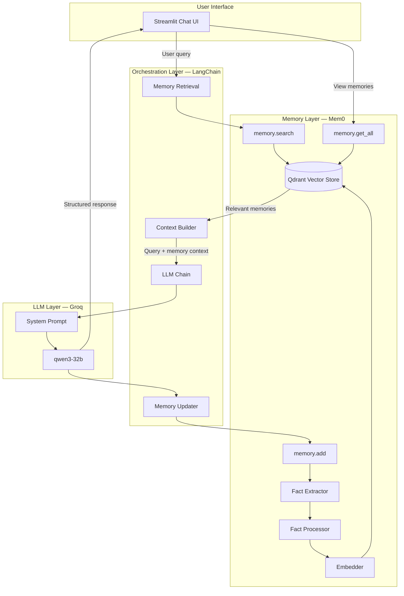

# Personal Research Assistant

An AI-powered research assistant that remembers your past sessions and builds on previous research. Ask questions, get structured answers with citations, and pick up where you left off without repeating context.

Built with **Groq**, **Mem0**, **LangChain**, and **Streamlit**.


---

## Architecture

The diagram above shows the full system flow. Below is a simplified interactive view:



### Request flow

1. User submits a question in the Streamlit UI.
2. LangChain searches Mem0 for relevant past memories for that user.
3. Retrieved memories are injected into the system prompt as context.
4. The query and context are sent to Groq (qwen3-32b).
5. The model returns a structured answer with sources and follow-up questions.
6. The conversation is stored in Mem0 for future sessions.

---

## Features

- **Persistent memory** — Mem0 stores meaningful facts from past research per user ID.
- **Context-aware answers** — New questions connect to what you have already explored.
- **Structured output** — Responses include sections, source links, and follow-up questions.
- **Memory browser** — View all stored memories from the sidebar.
- **Per-user isolation** — Each user ID has its own memory space.

---

## Tech Stack

| Layer | Technology | Role |
|-------|------------|------|
| Frontend | [Streamlit](https://streamlit.io) | Chat UI and memory viewer |
| Orchestration | [LangChain](https://langchain.com) | Prompt assembly and LLM invocation |
| LLM | [Groq](https://console.groq.com) — qwen3-32b | Research reasoning and response generation |
| Memory | [Mem0](https://mem0.ai) | Long-term semantic memory |
| Vector store | Qdrant (in-memory) | Embedding storage and retrieval |
| Embeddings | sentence-transformers/all-MiniLM-L6-v2 | Text vectorization |

---

## Project Structure

```
Personal research assistant/
├── app.py          # Streamlit frontend
├── memory.py       # Mem0 + LangChain chat logic
├── test.py         # Mem0 initialization test script
├── public/
│   └── arct.png    # Architecture diagram
├── .env            # API keys (not committed)
└── readme.md
```

---

## Prerequisites

- Python 3.10+
- A [Groq API key](https://console.groq.com)

---

## Setup

1. **Clone the repository**

   ```bash
   git clone <repository-url>
   cd "Personal research assistant"
   ```

2. **Create and activate a virtual environment**

   ```bash
   python -m venv venv
   # Windows
   venv\Scripts\activate
   # macOS / Linux
   source venv/bin/activate
   ```

3. **Install dependencies**

   ```bash
   pip install streamlit python-dotenv langchain langchain-groq mem0ai qdrant-client sentence-transformers duckduckgo-search langgraph
   ```

4. **Configure environment variables**

   Create a `.env` file in the project root:

   ```env
   GROQ_API_KEY=your_groq_api_key_here
   ```

5. **Verify Mem0 setup (optional)**

   ```bash
   python test.py
   ```

   You should see `SUCCESS: Memory initialized`.

---

## Usage

Start the Streamlit app:

```bash
streamlit run app.py
```

Open the URL shown in the terminal (typically `http://localhost:8501`).

1. Set your **User ID** in the sidebar (default: `user_01`).
2. Type a research question in the chat input.
3. Use **View all memories** to inspect stored facts.
4. Use **Clear chat** to reset the current session UI (memory is preserved).

---

## How Memory Works

When you send a message, Mem0:

1. **Searches** the vector store for memories related to your query.
2. **Injects** relevant facts into the system prompt.
3. **Generates** a response using Groq with that context.
4. **Extracts** new facts from the exchange and stores them for later.

Mem0 uses an in-memory Qdrant instance (`:memory:`), so memories reset when the process stops. For persistent storage across restarts, configure a local or remote Qdrant path in `memory.py`.

---

## Configuration

Key settings in `memory.py`:

| Setting | Value | Description |
|---------|-------|-------------|
| LLM model | `groq:qwen/qwen3-32b` | Main research model |
| Mem0 LLM | `llama-3.3-70b-versatile` | Fact extraction |
| Collection | `mem0_research_assistant` | Qdrant collection name |
| Embedder | `all-MiniLM-L6-v2` | 384-dim embeddings |
| Memory search limit | 5 | Max memories retrieved per query |

---

## License

This project is provided as-is for personal and educational use.
